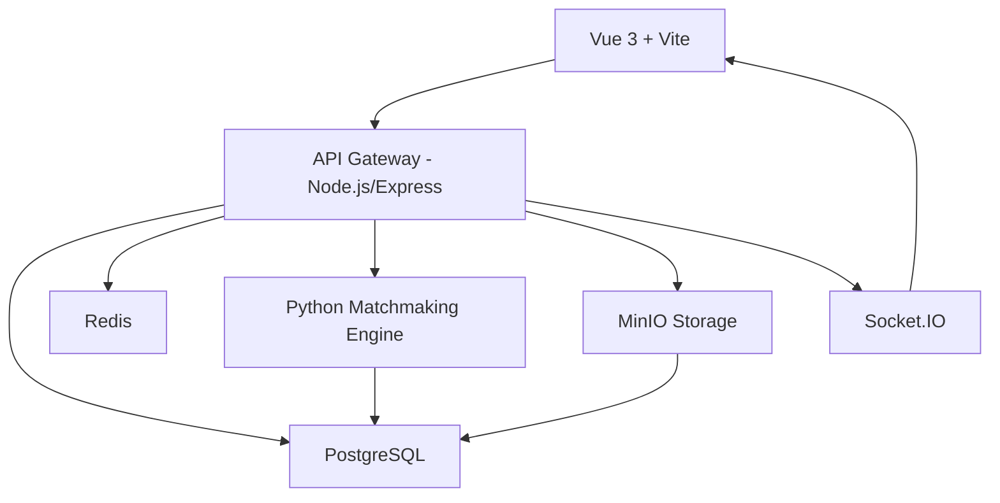

# Skill Bridge — Architecture Decision Record (ADR)

Dokumen ini mencatat keputusan arsitektur utama beserta opsi yang dipilih, alternatif yang dipertimbangkan, dan alasan di balik setiap keputusan.

---

## Daftar Keputusan

| ID | Keputusan | Opsi | Alternatif | Alasan |
|----|-----------|------|-----------|--------|
| ADR-01 | **Frontend:** Vue 3 + Composition API + Vite | Vue 3 | React, Svelte | Ringan, ekosistem matang, cocok untuk dashboard real-time, performa build cepat dengan Vite |
| ADR-02 | **Backend:** Node.js + Express (atau NestJS) | Node.js | Python/Django, Go | Satu bahasa dengan frontend (JS/TS), event-loop cocok untuk notifikasi real-time, komunitas besar |
| ADR-03 | **Database:** PostgreSQL | PostgreSQL | MySQL, MongoDB | Relasional kuat untuk data kompetensi & matchmaking, dukungan JSONB untuk fleksibilitas skor tes, ACID compliance |
| ADR-04 | **ORM:** Prisma | Prisma | TypeORM, Drizzle | Type-safe, migrasi otomatis, integrasi mudah dengan TypeScript |
| ADR-05 | **Autentikasi:** JWT + OTP WhatsApp | JWT | OAuth Google, SMS | JWT untuk session tanpa state; OTP WA karena penetrasi tinggi di kalangan SMK & UMKM |
| ADR-06 | **Matchmaking Engine:** Python (microservice terpisah) | Python | JS/Node, Go | Ekosistem ML/data-science matang (scikit-learn, pandas), mudah dikembangkan jadi AI-based |
| ADR-07 | **Storage:** MinIO (S3-compatible) | MinIO | AWS S3, Cloudinary | Self-hosted, biaya lebih rendah untuk UMKM lokal, S3 API kompatibel |
| ADR-08 | **Realtime:** Socket.IO | Socket.IO | SSE, WebSocket Native | Fallback otomatis ke long-polling, dukungan room untuk chat & notifikasi |
| ADR-09 | **Caching:** Redis | Redis | Memcached, In-memory | Mendukung pub/sub untuk notifikasi real-time, TTL otomatis, struktur data kaya |
| ADR-10 | **Container:** Docker + Docker Compose | Docker | Kubernetes (berat untuk awal) | Sederhana, reproducible, cukup untuk skala awal SMK-UMKM |
| ADR-11 | **Deployment:** VPS (DigitalOcean/Linode) | VPS | Serverless (Vercel/Lambda) | Kontrol penuh atas infrastruktur, biaya tetap lebih murah untuk traffic menengah |
| ADR-12 | **Monorepo:** Turborepo | Turborepo | Nx, Lerna | Tooling minimal, caching efisien, dokumentasi jelas |

---

## Detail Arsitektur

### Penjelasan Alur

1. **Client (Vue 3)** mengirim request ke **API Gateway (Node.js)**
2. API Gateway menangani auth (JWT), routing, dan validasi
3. Data disimpan di **PostgreSQL** melalui **Prisma ORM**
4. **Redis** menangani caching session, rate limiting, dan pub/sub untuk notifikasi
5. **Python microservice** khusus untuk komputasi matchmaking (terpisah agar bisa diskalakan independen)
6. **MinIO** menyimpan file (sertifikat, portofolio, avatar)
7. **Socket.IO** untuk fitur real-time (notifikasi, status match)
